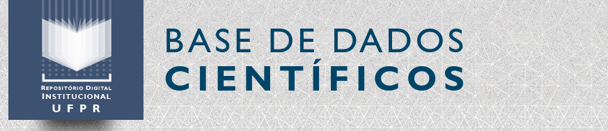

```{r, cache=FALSE, include=FALSE}
source("setup_knitr.R")
```

# Slides

.msmall[
- HTML: http://leg.ufpr.br/~fernandomayer/pesqrep-eco
- PDF: http://leg.ufpr.br/~fernandomayer/pesqrep-eco/pesqrep-eco.pdf
- Código-fonte: https://github.com/fernandomayer/pesqrep-slides
]

```{r, echo=FALSE, out.width='50%'}
knitr::include_graphics("qr_img.png")
```


---
# Introdução

**Evolução da tecnologia**

- Coleta, processamento e análise com grandes bases de dados

- Rotinas de análise cada vez mais sofisticadas e complexas

**Como garantir que tudo isso é confiável?**

- As análises que usamos atualmente são complexas: difícil descrever
  todos os **detalhes em palavras**

- Entender o que alguém fez em uma análise de dados atualmente, requer
  olhar para o **código**

---
# Um estudo de caso

## *The Duke trial saga*

Anil Potti *et al*: A Genomic Strategy to Refine Prognosis in
Early-Stage Non–Small-Cell Lung Cancer. *The New England Journal of
Medicine*. 2006.

- Prever a evolução do câncer de pulmão de um paciente usando matrizes
de expressão

Anil Potti *et al*: Genomic signatures to guide the use of
chemotherapeutics. *Nature Medicine*. 2006.

- Utilização de "linhas de células", para prever a quimioterapia mais
eficaz para pacientes que sofrem de câncer de pulmão, mama ou de
ovário

---
# Um estudo de caso

## *The Duke trial saga*

- O grupo de Duke iniciou **três ensaios clínicos** baseados nos
  trabalhos publicados
- Bioestatísticos do **MD Anderson Cancer Centre** tentaram reproduzir
  os resultados, para usar a nova técnica
- Foram encontradas diversas falhas como linhas de células com nomes
  errados e nomes e números de células inconsistentes
- Depois disso, uma série de investigações foram realizadas, levando a
  cessar os ensaios clínicos já iniciados
- Dr. Potti pediu demissão, e depois foi descoberto que ele tinha
  envolvimento com empresas da área biomédica.

.small[

Referências

- [An array of errors](https://www.economist.com/node/21528593). The
  Economist, 2011.
- [How Bright Promise in Cancer Testing Fell
  Apart](https://www.nytimes.com/2011/07/08/health/research/08genes.html).
  The New York Times, 2011.
]

---
class: center, middle, inverse
# Como a ciência funciona

---
# Como a ciência funciona

> *A Ciência é um processo de aprendizado da natureza, onde ideias
> concorrentes sobre como funciona o mundo são medidas contra
> observações.*

> Richard Feynman, 1965

- Descrições: incompletas
- Observações: incertas e imprecisas
- Métodos para avaliar a concordância entre as ideias e as observações =
  **Estatística**

---
# Como a ciência funciona

## Árvore de aprendizado (Platt, 1964)

1. Conceber **hipóteses alternativas**.
2. Conceber um **experimento crucial** (ou vários deles)
  - Possíveis resultados alternativos
  - Cada um poderá **excluir**, dentro do possível, **uma ou mais
    hipóteses**
3. Realizar o experimento de forma a obter resultados mais confiáveis
   possíveis.
4. **Reciclar o procedimento**
  - Criar sub-hipóteses ou hipóteses sequenciais para refinar as
   possibilidades que restam

---
# Como a ciência funciona

- Esta visão de Platt é naturalmente uma extensão lógica do trabalho de
**Popper**
>  *Uma hipótese **não pode ser provada**, apenas **desprovada** *

- A essência do método Popperiano é **"desafiar"** uma hipótese
  repetidamente.
  - Se a hipótese permanece válida então ela **não é validada**, mas
  adquire um certo **"grau de confiança"**

- Coincidindo com esta filosofia de Popper está o trabalho estatístico
de **Ronald Fisher**, **Karl Pearson**, **Jerzy Neyman** e outros, que
desenvolveram grande parte da teoria estatística atual

---
# Como a ciência funciona

## Aprendizado dedutivo-indutivo

- O processo **dedutivo-indutivo** de aprendizado é orientado pelo
  cérebro humano
- É conhecido desde o tempo de Aristóteles e faz parte de nossa
  **experiência cotidiana**

O aprendizado avança conforme ilustrado na figura abaixo (extraída de
Box, Hunter e Hunter, 2005):

```{r, echo=FALSE, out.width='70%'}
knitr::include_graphics("../img/deduction-induction.png")
```

---
# Como a ciência funciona

## Um loop de feedback

```{r, echo=FALSE, out.width='80%'}
knitr::include_graphics("../img/feedback-loop.png")
```

---
# Como a ciência funciona

```{r, echo=FALSE, out.width='60%'}
knitr::include_graphics("../img/feynman.jpg")
```

> *As declarações da ciência não são sobre o que é verdade e o que não é
verdade, mas declarações do que é conhecido com **diferentes graus de
certeza** *

@[ProfFeynman](https://twitter.com/ProfFeynman)

---
# Como a ciência funciona

## Análise de dados como arte

> *Ciência é conhecimento que entendemos tão bem que podemos ensiná-la
> para um computador. Todo o resto é arte.*

> Donald Knuth, 1974

O processo de análise de dados por um pesquisador pode ser comparado ao
processo de **criação de uma música por um músico**.

Os métodos já foram ensinados ao computador, cabe ao analista **saber
como juntar as ferramentas** e aplicá-las para responder questões
relevantes para a ciência e para as pessoas.

---
class: center, middle, inverse
# Replicação e reprodução na Ciência

---
# Replicação e reprodução na Ciência

- A **replicação** é um dos pilares fundamentais da ciência.

- É necessário que diversos cientistas coletem e analisem dados de forma
**independente**, e cheguem no **mesmo resultado**.

- Se muitas pessoas diferentes chegarem à mesma conclusão de forma
independente
  - Tendemos a pensar que o **resultado provavelmente é verdadeiro** (que
  vai de encontro com a filosofia de Popper)

---
# Replicação e reprodução na Ciência

**Replicação**: quando o pesquisador é capaz de chegar nos mesmos
resultados de um estudo anterior, seguindo os **mesmos métodos**, mas
com coleta de **novos dados**.

```{r, out.width='65%', echo=FALSE}
knitr::include_graphics("../img/replication.png")
```

---
# Replicação e reprodução na Ciência

Hoje em dia, a replicação tem se tornado **cada vez mais desafiadora**:

- Estudos maiores e mais caros
- Disponibilidade de recursos financeiros para pesquisas cada vez mais
  escassa

Além disso, existem estudos que **dificilmente podem ser replicados**:

- Avaliação do impacto de um terremoto
- Evolução do crescimento de uma floresta
- Estudo clínico que acompanhou as reações de pacientes à um medicamento
  durante 20 anos

---
# Replicação e reprodução na Ciência

- Existem muitas boas razões pelas quais não podemos replicar um estudo

- Se replicar não é possível, então existem duas opções:

1. Não fazer nada (não é uma opção de verdade)
2. Reproduzir a pesquisa

A ideia é criar uma espécie de **padrão mínimo**, ou um **meio-termo**
entre replicar um estudo e não fazer nada.

---
# Replicação e reprodução na Ciência

[Peng, 2011,
*Science*](http://science.sciencemag.org/content/334/6060/1226.full)

<br>

```{r, out.width='100%', echo=FALSE}
knitr::include_graphics("../img/F1.large.jpg")
```

---
# Replicação e reprodução na Ciência

**Reprodução**: quando o pesquisador é capaz de chegar nos mesmos
resultados de um estudo anterior, seguindo os **mesmos métodos**, e
utilizando os **mesmos dados**.

```{r, out.width='70%', echo=FALSE}

```

---
# Replicação e reprodução na Ciência

Uma parte fundamental da **pesquisa reproduzível** é tornar disponíveis
- Dados
- Métodos computacionais (em forma de **código**)

<br>

> Um projeto científico é **computacionalmente reproduzível** se um
segundo pesquisador (**incluindo você no futuro**) é capaz de recriar os
resultados finais do projeto, incluindo as descobertas quantitativas,
tabelas e figuras, **dado apenas um conjunto de arquivos e instruções
escritas**.

> Justin Kitzes

---
# Replicação e reprodução na Ciência

Se reproduzir uma análise leva à um resultado já conhecido e esperado,
então **qual o propósito de uma pesquisa reproduzível**?

.msmall[
.pull-left-60[
**Para a Ciência:**

- Padrão para **julgar** descobertas científicas
- **Validação** da análise de dados
- Diferentes cientistas, com diferentes visões e ideias podem colaborar
  no sentido de continuar a pesquisa, ou sugerir outras abordagens
  (**análise de dados como arte**)
- Reprodutibilidade aprimora a replicabilidade
- Evita esforço duplicado e encoraja o desenvolvimento cumulativo de
  conhecimento
]
.pull-right-40[
**Para você:**

- **Maior impacto da pesquisa**
- Melhores hábitos de trabalho
- Melhor trabalho em equipe
- Mudanças futuras são mais fáceis
]
]

---
# Replicação e reprodução na Ciência

**Possíveis preocupações:**

- Como fica a questão da **propriedade intelectual**?

- Como fica a disponibilização de dados que foram coletados com
  **financiamento** privado ou público?

- Até que ponto a disponibilização dos dados não irá prejudicar meus
  **projetos futuros**?

- Será que não posso sofrer **plágio**?

---
# Replicação e reprodução na Ciência

- A revista **Science** teve uma edição inteira dedicada à
  reprodutibilidade.

- Muitas revistas científicas tem atualizado suas políticas de
  publicação, para encorajar a reprodutibilidade dos artigos publicados.
    - *Public Library of Science* (PLoS)
    - *Biostatistics*
    - *Foundation for Open Access Statistics* (FOAS)

- Cientistas estão preocupados em fazer pesquisa reproduzível, mas...
  - Mesmo na PLoS, por exemplo, cerca de 60% das publicações não
  disponibilizam dados suficientes

---
# Replicação e reprodução na Ciência

**An empirical analysis of journal policy effectiveness for computational
reproducibility**. [PNAS,
2018](http://www.pnas.org/content/115/11/2584).

*Victoria Stodden, Jennifer Seiler, and Zhaokun Ma*

- Requisitaram dados e códigos para autores de artigos da revista
  *Science* publicados após 2011 (quando a política de publicação foi
  alterada)
- Tentaram reproduzir os estudos de 204 artigos
- Obtiveram dados e códigos de 44% dos autores
- Conseguiram reproduzir 26% deles

---
# Replicação e reprodução na Ciência

```{r, echo=FALSE, out.width='55%'}
knitr::include_graphics("../img/tab1.png")
```

[Stodden *et al*, 2018](http://www.pnas.org/content/115/11/2584).

---
# Replicação e reprodução na Ciência

Algumas respostas recebidas ([Stodden *et al*,
2018](http://www.pnas.org/content/115/11/2584)):

.msmall[

*Tenho que dizer que essa é uma **solicitação pouco usual** [...]. Peça
ao seu orientador para me mandar um email com explicações detalhadas
...*

*Os arquivos de dados permanecem sob **nossa propriedade e não são
disponibilizados de graça** ...*

*O código que escrevemos é **resultado de anos de esforço acumulado**
[...]. Os dados foram coletados por diversos colaboradores, então teria
que **pedir permissão à eles também** ...*

*Para os cálculos, eu **usei meus próprios códigos, e não há uma versão
pública deles**. Como o código **não é muito amigável**, eu prefiro não
compartilhar ...*

*Nosso código **não foi escrito pensando em ser compartilhado com outras
pessoas**. Os códigos **não são documentados**, e não temos tempo de
fazer isso ...*

*R é um software livre disponível em www.r-project.org. Como você deve
saber, **os modelos são muito complicados** [...]. Eu usei Matlab para a
geometria.*

]

---
# Replicação e reprodução no Brasil

```{r, echo=FALSE, out.width='100%'}
knitr::include_graphics("../img/fapesp.png")
```

<!-- - [Revista FAPESP, 2014](http://revistapesquisa.fapesp.br/2014/04/24/ciencia-transparente/?cat=politica) -->
<!-- - [Revista FAPESP, 2018](http://revistapesquisa.fapesp.br/2018/01/16/informacao-com-qualidade/?cat=politica) -->
<!-- - [Revista FAPESP, 2018](http://revistapesquisa.fapesp.br/2018/03/20/disseminacao-desigual/?cat=politica) -->

---
# Replicação e reprodução no Brasil

```{r, echo=FALSE, out.width='50%'}

```

- Estimar a reprodutibilidade da ciência biomédica brasileira
- A meta é **reproduzir uma amostra de 50 a 100 experimentos de artigos
brasileiros** em 3 a 5 áreas diferentes de pesquisa
- Cada experimento será **reproduzido em 3 laboratórios diferentes**,
com protocolos pré-registrados e o mais próximo do estudo original
- A meta é estimar a reprodutibilidade da ciência brasileira de maneira
ampla e **propor soluções para melhorá-la**
- https://www.reprodutibilidade.bio.br

---
class: center, middle, inverse
# Elementos da reprodutibilidade

---
# Elementos da reprodutibilidade

Quatro elementos principais:

1. **Dados**: Os dados utilizados na análise devem ser disponibilizados
   *da maneira como foram analisados originalmente*.
2. **Código**: O código utilizado para produzir os resultados
   apresentados.
3. **Documentação**: Descrever o **código** e os **dados** utilizados na
   análise de maneira clara.
4. **Distribuição**: Distribuir todos esses elementos de maneira que
   sejam facilmente acessíveis.

---
# Elementos da reprodutibilidade

Estudos recentes tem mostrado que cientistas passam cerca de 30% de seu
tempo escrevendo códigos.

No entanto, mais de 90% deles são primariamente *auto-didatas*, e portanto
carecem de exposição à boas práticas de desenvolvimento de *software*
como:

- Escrever códigos de fácil manutenção
- Usar um *sistema de controle de versões*
- Rastreadores de *bugs*
- Testes unitários
- Automação de tarefas

---
class: center, middle, inverse
# Ferramentas da reprodutibilidade

---
# Ferramentas da reprodutibilidade

**Publicar dados e códigos não é necessariamente uma tarefa trivial.**

Problemas comuns:

- Muitos autores simplesmente "colocam" arquivos na *web*.
- Existem jornais que disponibilizam materiais suplementares, mas que
  sabidamente são desorganizados ou falhos.
- Mesmo quando dados e códigos estão disponíveis, o leitor ainda tem que
  baixar dados e códigos, e então tentar juntar tudo, uma tarefa que
  geralmente não é fácil e desencoraja a maioria das pessoas.
- O leitor pode não ter os mesmos recursos computacionais que o
  autor.

---
# Ferramentas da reprodutibilidade

Existem várias ferramentas para auxiliar a tornar uma pesquisa
reproduzível. Algumas que valem a pena conhecer são:

- **R**: para análise de dados, gráficos e tabelas. **Importante:**
  software livre e de código aberto.
- **knitr** e **rmarkdown**: pacotes do R para *literate programming*.
  Permite escrever texto e código (executável) em um mesmo documento.
- **Linguagens de marcação**: instruções para estruturar um texto.
  Exemplos são LaTeX, Markdown, e HTML.
- **Editores de texto**: que permitam trabalhar com todos os formatos.
  Exemplos: Emacs, Vim, RStudio.
- **Armazenamento e versionamento**: serviços como Dropbox, mas
  principalmente Git (Github, Gitlab, etc)
- **Programas em shell**: permitem automatizar uma série de tarefas na
  camada de arquivos e dados.

---
# Ferramentas da reprodutibilidade

Algumas dicas para ajudar a tornar um projeto reproduzível:

1. Documente tudo!
2. Tudo é um arquivo (de texto)
3. Todos os arquivos devem poder ser lidos por humanos
4. Organize e "amarre" seus arquivos de forma apropriada
5. Tenha um plano para organizar, armazenar, e tornar seus arquivos
   disponíveis

---
# Ferramentas da reprodutibilidade

```{r, echo=FALSE, out.width='60%'}
knitr::include_graphics("../img/nature_toolkit.png")
```
[Nature, 2018](https://www.nature.com/articles/d41586-018-05990-5)

- **Use code**
- **Go open-source**
- **Track your versions**
- **Document your analyses**
- **Archive your data**
- **Replicate your environment**
- **Automate**
- **Get help**. [Software Carpentry](https://software-carpentry.org/).

---
# Ferramentas da reprodutibilidade

## Documentos dinâmicos

> *Instead of imagining that our main task is to instruct a computer what
> to do, let us concentrate rather on explaining to humans what we want
> the computer to do.*
>
> Donald Knuth

Uma das ferramentas mais importantes para pesquisa reproduzível nos dias
de hoje.

A proposta é de distribuir dados e códigos **documentados** de uma
pesquisa científica, de maneira acessível e auto-contida.

---
# Ferramentas da reprodutibilidade

## Documentos dinâmicos

Decorre diretamente de *literate programming* (Knuth, 1984)

- Da mesma forma que um *software* possui seu código-fonte, um documento
dinâmico é o código-fonte de um relatório.
- É uma combinação de código de computador e a descrição dos resultado
  que o código está gerando
- Quando **compilamos** o documento, o código é executado, assim obtemos
um documento que mistura **código** e **texto**

No R:

- `Sweave`
- `knitr`
- `rmarkdown`

---
# Ferramentas da reprodutibilidade

## Distribuição de dados

A disponibilização (e aquisição) de dados abertos pode ser feita através
de **repositórios de dados**.

- [figshare](https://figshare.com/): permite publicar individualmente
  figuras, imagens, tabelas, vídeos, e dados. Cada compartilhamento
  possui um **DOI**, e assim pode ser referenciado e citado.
- [zenodo](https://zenodo.org/): compartilhamento de texto e dados.
  Também possui DOI e identifica pesquisadores pelo
  [Orcid](https://orcid.org/).
- [Nature recommended data
  repositories](https://www.nature.com/sdata/policies/repositories):
  compilação de diversos repositórios de áreas específicas
- [re3data](https://www.re3data.org/): *REgistry of REsearch Data
  REpositories* é um buscador de bases de dados abertos

---
# Ferramentas da reprodutibilidade

## Distribuição de dados na UFPR

```{r, echo=FALSE, out.width='60%'}

```

- A Base de Dados Científicos da Universidade Federal do Paraná
(BDC/UFPR) é o resultado de uma parceria entre o Centro de Computação
Científica e Software Livre (C3SL), e o Sistema de Bibliotecas (SiBi)
UFPR.
- Visa reunir os dados científicos utilizados nas pesquisas que foram
publicadas pela comunidade da UFPR em teses, dissertações, artigos de
revistas, e outros materiais bibliográficos.
- Também possui DOI
- https://bdc.c3sl.ufpr.br/

---
# Ferramentas da reprodutibilidade

## Exemplos de pesquisa reproduzível

**Paper companions** do LEG (desde 2008)

- Ideia de distribuir códigos e dados de artigos publicados
- http://www.leg.ufpr.br/papercompanions
  - Zeviani, *et al*. [The Gamma-count distribution in the analysis of
  experimental underdispersed
  data](http://www.leg.ufpr.br/doku.php/publications:papercompanions:zeviani-jas2014).
  *Journal of Applied Statistics*, 2014.
  - Bonat & Ribeiro Jr. [Practical likelihood analysis for spatial
  generalized linear mixed
  models](http://www.leg.ufpr.br/doku.php/publications:papercompanions:sglmm). *Environmetrics*, 2015.

---
# Mais recursos

- Software Carpentry [Lessons](https://software-carpentry.org/lessons/)
- [Reproducibility in
  Science](http://ropensci.github.io/reproducibility-guide/). A Guide to
  enhancing reproducibility in scientific results and writing (rOpensci)
- [Pesquisa reproduzível com R: de documentos dinâmicos a
  pacotes](http://cursos.leg.ufpr.br/prr/): minicurso realizado na RBRAS
  2016 pelos Professores Fernando Mayer e Walmes Zeviani.
- [R Markdown](https://youtu.be/qFh4XtckP2k): vídeo apresentando a
  funcionalidade do R Markdown (2015, Meetup R São Paulo).

---
# Referências

- Box, GEP; Hunter, JS; Hunter, WG. [Statistics for experimenters:
  Design Innovation and Discovery](http://statisticsforexperimenters.net).
  John Wiley & Sons, 2005.
- Kitzes, J., Turek, D., & Deniz, F. (Eds.). (2018). [The Practice of
  Reproducible Research: Case Studies and Lessons from the
  Data-Intensive
  Sciences](https://www.practicereproducibleresearch.org/).
  Oakland, CA: University of California Press
- Gandrud, C. (2015). [Reproducible Research with R and R
  Studio](https://www.crcpress.com/Reproducible-Research-with-R-and-R-Studio-Second-Edition/Gandrud/p/book/9781498715379)
- Stodden, V., Leisch, F., Peng, RD. (2014). [Implementing Reproducible
  Research](https://www.crcpress.com/Implementing-Reproducible-Research/Stodden-Leisch-Peng/p/book/9781466561595)
- Gentleman, R, Lang, DT. (2012). [Statistical Analyses and Reproducible
  Research](http://www.tandfonline.com/doi/abs/10.1198/106186007X178663).
  Journal of Computational and Graphical Statistics.

---
class: center, middle, inverse
# Obrigado!
